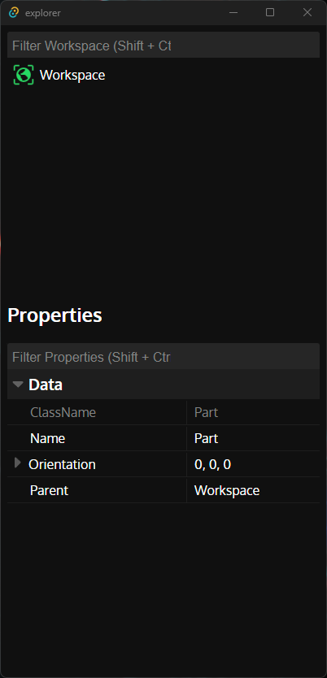

# A Tree-Based Explorer that Operates via Websockets

### Built sort-of for Roblox

Not finished, likely won't be

  

## Build

Assuming you have proper dependencies installed,

`npm run tauri dev`

## Test

A test websocket script is located within `tests/websocket.lua`

You can run it with [Lune](https://github.com/lune-org/lune)

`lune tests/websocket.lua`
